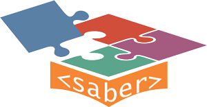

## Bem-vindo ao Projeto Saber

   
    

   
    

Este projeto é parte integrante da proposta de mestrado do aluno [Paulo Henrique Eli](http://lattes.cnpq.br/9175378911774164), orientado pelas professoras Dra. [Olga Yevseyeva](http://lattes.cnpq.br/8339563650267766) e Dra. [Luciana Bolan Frigo](http://lattes.cnpq.br/6348215204947696) da Universidade Federal de Santa Catarina (UFSC), Campus Araranguá.

O projeto foi desenvolvido de forma a dispensar conhecimentos técnicos avançados quanto ao desenvolvimento de aplicações web. Tal característica pode ser observada na organização das pastas e metodologias relacionadas a codificação das partes.

Ressalta-se que este documento não realiza qualquer instrução de como realizar modificações ou adaptações. Informações técnicas ou maiores detalhes podem ser solicitados ao autor via contato por e-mail. [pauloeli.edu@gmail.com](mailto:pauloeli.edu@gmail.com).

### Informações Técnicas

Antes que sejam explanadas as características do projeto, destaca-se que **os termos de licença e uso das bibliotecas e frameworks utilizados no projeto devem ser obedecidos, sendo de completa responsabilidade do usuário o respeito a elas**.

### Bibliotecas

Este projeto utiliza alguns frameworks e bibliotecas em sua construção, dentre as quais destacam-se: 

* [AngularJS](https://angularjs.org/), 
* [Google Blockly](https://developers.google.com/blockly/), 
* [Material Design Lite](https://getmdl.io/), 
* [jQuery](https://jquery.com/), 
* [Bootstrap](https://getbootstrap.com/) 
* [Bootbox.js](http://bootboxjs.com/)
* [FileSaver.js](https://github.com/eligrey/FileSaver.js)

### Imagens

Todas as imagens foram obtidas no portal [Pixabay](https://pixabay.com/pt/), sendo todas de livre reprodução. 
A licença das imagens pode ser observada nos seguintes links:

* [Imagem 1](https://pixabay.com/pt/puzzle-f%C3%B3sforo-caber-desaparecido-693870/)
* [Imagem 2](https://pixabay.com/pt/puzzle-part%C3%ADculas-%C3%BAltimos-pe%C3%A7a-654956/)
* [Imagem 3](https://pixabay.com/pt/tiro-com-arco-seta-gol-esportes-472932/)
* [Imagem 4](https://pixabay.com/pt/amigos-confian%C3%A7a-amizade-juntos-1015312/)
* [Imagem 5](https://pixabay.com/pt/pintura-notebook-escova-l%C3%A1pis-1280556/)
* [Imagem 6](https://pixabay.com/pt/qualidade-gancho-marca-de-sele%C3%A7%C3%A3o-787663/)
* [Imagem 7](https://pixabay.com/pt/etapas-escadas-at%C3%A9-escada-388914/)

### FAQ

A plataforma de dúvidas e ajuda foi desenvolvido na ferramenta [phpMyFaq](http://www.phpmyfaq.de) de autoria de Thorsten Rinne e comunidade. Buscando simplificar a implantação do projeto e garantindo a sua capacidade adaptativa, esta publicação não contemplará os arquivos de instalação da ferramenta. Caso seja de interesse, informações acerca de como realizar a instalação pode ser encontradas [neste endereço](http://www.phpmyfaq.de/documentation).

Devido a particularidades da ferramenta, os arquivos relacionados aos materiais de ajuda confeccionados encontram-se dispostos dentro da pasta **phpMyFaq**, organizados por categorias/pastas. Dentro de cada uma das pastas há um arquivo "source" contendo o código fonte HTML do material e os seus respectivos anexos.

### Pesquisa

A pesquisa foi desenvolvida na ferramenta [LimeSurvey](https://www.limesurvey.org). Por ser algo estritamente relacionado ao desenvolvimento da dissertação, esta publicação não contemplará os arquivos de sua instalação. Caso seja de interesse, informações acerca de como realizar a instalação pode ser encontradas [neste endereço](https://www.limesurvey.org/community/forums).

### Vídeos

Todos os vídeos confeccionados para o projeto estão disponibilizados no YouTube, no canal [Projeto Saber](https://www.youtube.com/channel/UCV-sZIhAazpMi6C0RQRHgSw)

### Licença

Além de obedecidas as licenças específicas de cada uma das partes de terceiros utilizadas no projeto, o projeto é disponibilizado sob a licença [MIT](http://escolhaumalicenca.com.br/licencas/mit/).
